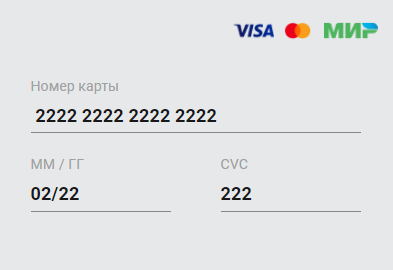
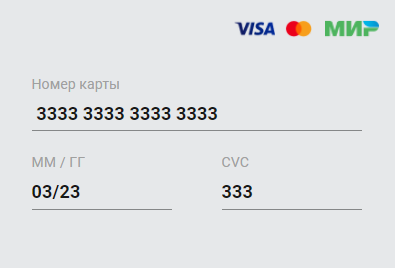

# Курсовой проект "Сервис перевода денег"

REST-сервис, предоставляющий интерфейс для перевода денег с одной карты на другую по заранее описанной спецификации.

## Запуск

Для запуска приложения необходимо склонировать репозиторий, открыть корневую папку проекта и выполнить команду `./mvnw package`.
После упаковки проекта необходимо создать docker-образ с помощью команды `docker build -t money_transfer_service .`.
Затем запустить сервис с помощью команды `docker-compose up -d money_transfer_service`.

## Описание

Проект предоставляет сервис для перевода денег с карты на карту. 

Приложение написано с использованием Spring Boot.

Код покрыт Unit тестами с использованием Mockito.

Добавлены интеграционные тесты с использованием Testcontainers.

Логирование с использованием log4j.

Сервис реализует все методы перевода описанные в протоколе: https://github.com/netology-code/jd-homeworks/blob/master/diploma/MoneyTransferServiceSpecification.yaml

## Настройка и тестовые данные

В файле `src/main/resources/application.properties` находятся следующие настройки и их значения:

`server.port = 5500` - порт приложения

`verification.test.value = 0000` - код верификации операции

`commission.pct = 0.01` - комиссионный процент

`rounding.scale = 2` - шкала округления

`rounding.mode = HALF_UP` - режим округления

По умолчанию создаются 3 карты:

## Фронт приложение

UI для перевода денег с карты на карту: https://github.com/serp-ya/card-transfer

Развернутое демо: https://serp-ya.github.io/card-transfer/
